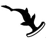

# Testing picture relative path

## Realtive 1: (./pics/norbit.png)

## Relative 2: (pics/norbit.png)

## Direct link to image(https://stash.internal.aptomar.com/)projects/ASW/repos/test_mark_down/browse/pics/norbit.png

## Direct link to image only: (https://stash.internal.aptomar.com/)projects/ASW/repos/test_mark_down/browse/pics/norbit.png?at=0cbd0007743a3fffaa4ab1f09ebfc0129584ca23&raw

# Image in same folder

## Realtive 1: (./halico.png)

## Relative 2: (halico.png)
